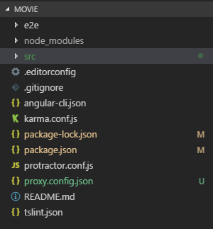

# 自定义movie项目

## 一、总体介绍

本项目是基于angular2开发的，所以项目内容大致分为7个组件和一个服务，分别为navbar导航组件、轮播图组件、热映电影列表组件、电影详情组件、top250榜单组件、home组件、footer组件和一个用于获取电影相关信息的服务。总的来说实现了热映电影列表界面、电影详情界面、top250榜单界面。

## 二、开发环境

* IDE：vsCode
* 运行环境：Node
* 开发语言： Typescript
* 框架：Angular2
* 三方包： Bootstrap
* api接口： 豆瓣[API](https://developers.douban.com/)

## 三、功能模块

## 四、内容大致说明

### 4.1 项目目录结构说明

1. node_modules： 第三方依赖包存放目录
2. src： 应用源代码目录
3. angular-cli.json： 命令行工具的配置文件，后面可能会更改它，引入一些第三方依赖
4. karma.conf.js：karma的配置文件，用于单元测试
5. package.json： npm工具的配置文件，列出了该程序所使用的第三方依赖包
6. protractor.conf.js：也是一个自动化测试的配置文件
7. proxy.config.json： 是自己建的一个文件，用来解决跨域问题

### 4.2 界面展示及相关功能介绍

1. 项目中的数据，利用angular中的http连豆瓣api接口获取。
2. 利用angular的依赖注入，来获取service中的方法并得到相应的json数据
3. 利用angular的ngFor指令来将数据循环绑定在页面中，其中还有用到样式绑定、Number管道
4. 利用angular路由，来进行页面之间的跳转、传参

#### 4.2.1 热映界面

 

1. 利用bootstrap的栅格系统排版
2. 当鼠标hover影视上时，会有用css3完成的一些交互特效，展示电影导演、主演等一些信息，效果在演示时展示..

#### 4.2.2 电影详情界面

1. 路由跳转时通过传过来的电影ID来获取其对应电影的信息
2. 也是借助bootstrap中的巨幕组件来展示
3. 其中评分那一行的星星展示，是根据评分来渲染的，借助css即可完成

#### 4.2.3 Top250界面

1. 借助bootstrap中的媒体对象来排版
2. 利用css3，hover上去时也会有一个突出显示的小效果
3. 借助angular2 中的ng2-pagination分页组件，来实现分页效果，每页展示10条数据
4. 同时点击电影会跳转到对应的详情页面

## 5.总结

由于一段时间没用angular2，所以这次也是大致过了一次angular的一些特性，其中也踩到一些坑，不过还好都解决了，记录在另一篇md文档中。由于时间原因，本次项目中即将上映、和电影搜索会在后续中完成，然后打包部署.
